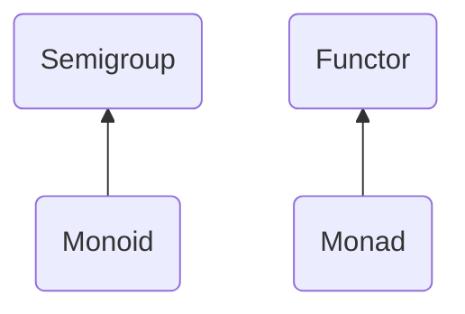

# Prep

## What we know so far
 - Scala implicits, TC (type class) pattern, extension methods
 - Cats type classes

## Major type classes
 - `Semigroup`
   - Methods: `combine`
   - Syntax: `|+|`
 - `Monoid` extends `Semigroup`
   - Methods: `empty`
 - `Functor`
   - Methods: `map`
 - `Monad` extends `Functor`
   - Methods: `pure`, `flatMap`
   - Syntax: `for-comprehension`, `>>`, `*>`, `<<`, `<*`

