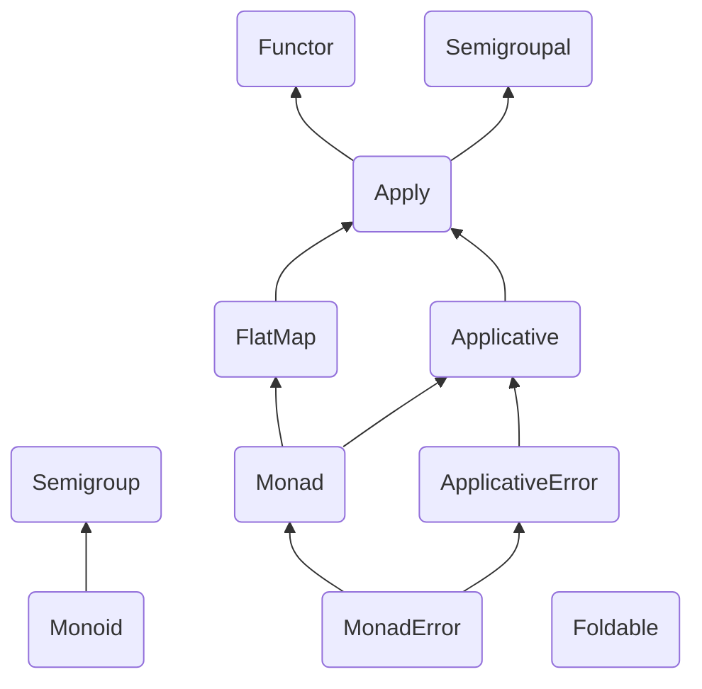

# Cats Type Class Hierarchy

```mermaid
flowchart BT
    MD(Monoid) --> S(Semigroup)
    ME(MonadError) --> M(Monad)
    ME --> AE(ApplicativeError)
    M --> FM(FlatMap)
    FM --> AP(Apply)
    M --> A(Applicative)
    AE --> A
    A --> AP
    AP --> F(Functor)
    AP --> SL(Semigroupal)
    FO(Foldable)
```
