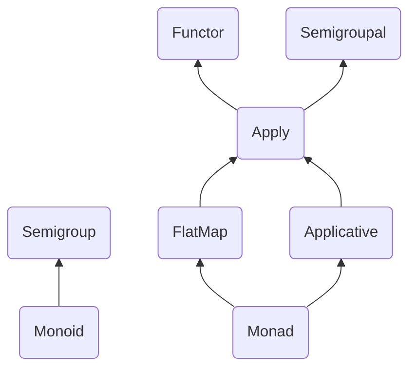

# Cats Type Class Hierarchy

```mermaid
flowchart BT
    MO(Monoid) --> S(Semigroup)
    MA(Monad) --> FM(FlatMap)
    FM --> AP(Apply)
    MA --> A(Applicative)
    A --> AP
    AP --> F(Functor)
    AP --> SL(Semigroupal)
```
