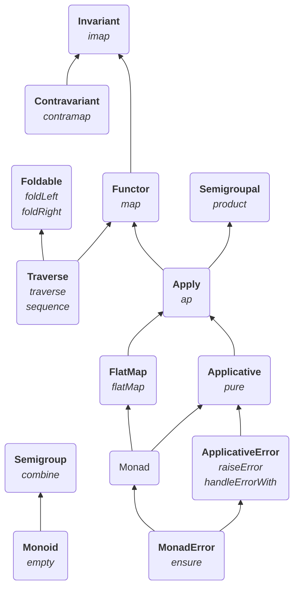

# Cats Type Class Hierarchy

```mermaid
flowchart BT
    S("`**Semigroup**
    _combine_`")
    MD("`**Monoid**
    _empty_`")
    MD --> S
    I("`**Invariant**
    _imap_`")
    C("`**Contravariant**
    _contramap_`")
    C --> I
    F("`**Functor**
    _map_`")
    F ---> I
    FO("`**Foldable**
    _foldLeft_
    _foldRight_`")
    T("`**Traverse**
    _traverse_
    _sequence_`")
    T --> FO
    T --> F
    SL("`**Semigroupal**
    _product_`")
    AP("`**Apply**
    _ap_`")
    AP --> F
    AP --> SL
    FM("`**FlatMap**
    _flatMap_`")
    FM --> AP
    A("`**Applicative**
    _pure_`")
    A --> AP
    AE("`**ApplicativeError**
    _raiseError_
    _handleErrorWith_`")
    AE --> A
    M(Monad)
    M --> FM
    M --> A
    ME("`**MonadError**
    _ensure_`")
    ME --> M
    ME --> AE
```
